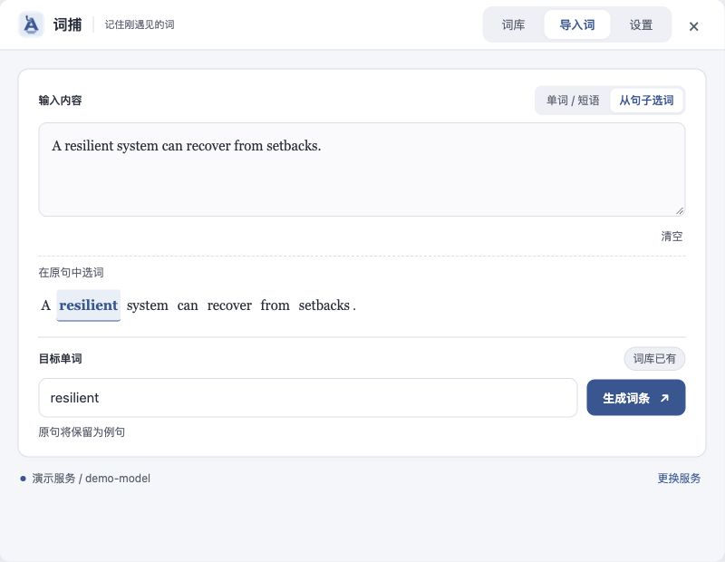
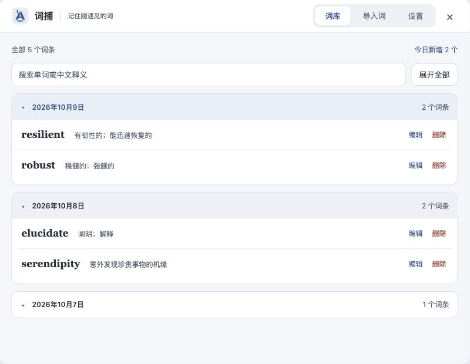
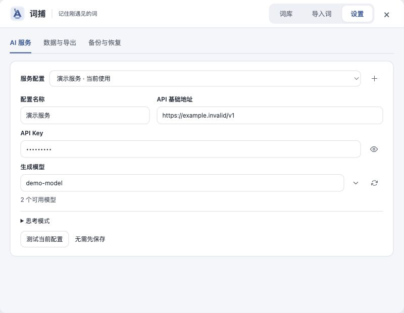
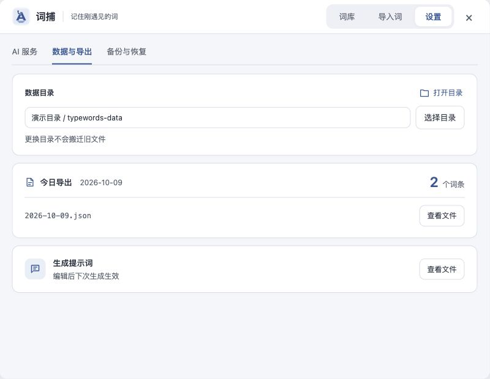

<div align="center">
  
  <h1>词捕 · Word Catcher</h1>
  <p><strong>记住刚遇见的词。</strong></p>
  <p>在阅读中捕捉生词，用 AI 整理释义与例句，再带到 TypeWords 练习。</p>
  <p>
    
    
    
  </p>
  <p>
    <a href="#快速开始">快速开始</a> ·
    <a href="#界面预览">界面预览</a> ·
    <a href="utools-plugin-word-catcher/docs/data-storage.md">数据与迁移</a> ·
    <a href="utools-plugin-word-catcher/CHANGELOG.md">更新记录</a>
  </p>
</div>

---

读论文、文档或网页时，遇到的生词往往散落在笔记里。词捕把 **记录 → 理解 → 整理 → 练习** 连起来：通过 [uTools](https://www.u-tools.cn/) 划词或手动输入，生成可编辑的词条，按天积累，导出到 [TypeWords](https://typewords.cc/words)。

```text
选中英文词句 → 选择目标词 → AI 生成 → 检查并保存 → 导入 TypeWords
```

## 功能亮点

| 能力           | 用起来是什么样                                               |
| -------------- | ------------------------------------------------------------ |
| 带着语境记词   | 输入句子后点击目标词，原句清洗后作为第一条例句               |
| 生成完整词条   | 英美音标、中文释义、双语例句、搭配、近义词、派生词与简要词源 |
| 保存前可修订   | 编辑常用字段，或展开完整 JSON；更新已有词保留创建日期        |
| 按日期管理词库 | 当天展开、历史折叠；英文单词和中文释义都可跨日期搜索         |
| 自选 AI 服务   | 多套 OpenAI 兼容配置，获取、搜索或手填模型，保存前可测试连接 |
| 每日导出       | 当天创建的词条自动同步为一个 TypeWords JSON 文件             |
| 备份与迁移     | 词库合并恢复、服务配置单独导出，同名词保留本机版本           |

正式主题采用雾白墨蓝，重点留给词条和操作。界面适配较小窗口，设置保存栏仅在有修改或错误时出现。

## 界面预览

下面的截图使用隔离演示数据，不含真实词库、服务地址或凭证。

<table>
  <tr>
    <td width="50%" align="center"><strong>从句子中捕捉生词</strong><br /></td>
    <td width="50%" align="center"><strong>按日期整理积累</strong><br /></td>
  </tr>
  <tr>
    <td width="50%" align="center"><strong>选择自己的 AI 服务</strong><br /></td>
    <td width="50%" align="center"><strong>找到导出与提示词</strong><br /></td>
  </tr>
</table>

## 快速开始

当前提供源码安装与本地打包方式。

### 1. 安装到 uTools

下载本仓库源码并解压，或使用 Git：

```sh
git clone https://github.com/xiaopengli2003/MyTypeWords.git
```

在 uTools 的 **开发者工具** 中新建项目，选择：

```text
MyTypeWords/utools-plugin-word-catcher/plugin.json
```

插件运行只使用 Node 原生模块，**源码安装无需先执行 npm install**。Node.js 与 npm 只在验证、格式化和构建发布目录时需要。

### 2. 配置 AI 服务

使用「词捕」「记单词」或「记生词」打开插件，进入 **设置 → AI 服务**：

| 设置         | 如何填写                                                        |
| ------------ | --------------------------------------------------------------- |
| API 基础地址 | 服务商的 OpenAI 兼容基础地址，例如 `https://example.com/v1`     |
| API Key      | 服务商提供的 Key；localhost、127.0.0.1 或 ::1 本机服务可留空    |
| 生成模型     | 点击刷新图标获取列表，搜索选择；接口不提供列表时直接填写模型 ID |

点击 **测试当前配置** 检查连接，再点 **保存设置**。配置支持分步保存，生成时才要求地址、模型及远程服务的 Key 填写完整。思考模式默认关闭，需要服务商支持时再开启。

### 3. 开始记录

在“导入词”输入单词、短语或英文句子。句子模式下选中目标词，点击 **生成词条**；检查释义和例句后 **收入词库**。

也可以通过 uTools 划词功能选中英文，使用“记入生词本”进入插件，文本会自动带入。

### 4. 导入 TypeWords

进入 **设置 → 数据与导出 → 今日导出 → 查看文件**，找到 `daily/YYYY-MM-DD.json`，在 TypeWords 自定义词典页面导入。

当天保存、编辑或删除会同步当日文件；历史每日文件保留为存档，编辑旧词不会改写它们。

## 日常使用

- **记单词与短语**：自动清理包裹引号、所有格、PDF 断行、连字和多余空白；大小写和词形由 AI 判断，保存前可手动调整。
- **保留阅读语境**：句中词元按原顺序展示，支持连字符复合词和含数字的词；原句优先作为例句。
- **管理历史**：按创建日期折叠，搜索自动展开匹配分组；更新已有词不改变它所属的日期。
- **修改生成规则**：定位并编辑 `prompts/system-prompt.md`，下次生成使用修改后的提示词。
- **切换服务**：选择配置，点“设为当前使用”并保存；只切换要编辑的配置不会改变生成服务。

| 快捷键                      | 操作     |
| --------------------------- | -------- |
| 目标词输入框中 `Enter`      | 生成词条 |
| 输入区中 `⌘ / Ctrl + Enter` | 生成词条 |
| 编辑器中 `⌘ / Ctrl + Enter` | 保存词条 |

AI 生成结果需要自行检查，尤其是专业术语、音标和词源。v1.0.0 尚未接入朗读；可行方案记录在 [朗读调研](utools-plugin-word-catcher/docs/speech-research.md)。

## 数据放在哪里？

新用户无需先创建文件夹。默认在系统“文档”目录下使用 `MyTypeWords/typewords-data`，首次保存设置自动建立所需文件：

```text
typewords-data/
├── config.json                  # 服务配置，含明文 API Key
├── daily/
│   └── YYYY-MM-DD.json           # TypeWords 每日导出
└── prompts/
    └── system-prompt.md          # 自定义生成规则
```

**完整词库、采集原文与日期信息保存在 uTools 本地库中。** 每日导出是练习文件，不能代替完整词库备份。需要换位置时，在“数据与导出”选择本机目录并保存；更换目录不会自动搬迁旧文件。

迁移到新电脑时：

1. 原电脑分别 **导出词库** 和 **导出配置**。
2. 新电脑安装插件，使用默认目录或选择并保存本机目录。
3. **合并词库** 恢复词条，再 **替换配置** 恢复服务；导入配置保留新电脑的数据目录。

词库备份不包含 Key，服务配置备份包含明文 Key。生成请求会把目标词及所选原句发送给你配置的 AI 服务；单纯浏览词库不会调用 AI。个人数据目录与配置不随本仓库提交。

更多规则见 [数据存储与迁移](utools-plugin-word-catcher/docs/data-storage.md)。

## 开发与验证

开发需要 **Node.js 20+**。在插件源码目录中运行：

```sh
cd MyTypeWords/utools-plugin-word-catcher
npm ci
npm run verify
npm run preview
```

| 命令              | 用途                                                    |
| ----------------- | ------------------------------------------------------- |
| `npm run verify`  | 格式、语法、版本和 Logo 检查，以及六组回归测试          |
| `npm run preview` | 启动本机隔离预览，可切换窗口尺寸；不访问真实 API 或词库 |
| `npm run format`  | 按统一规范格式化源码                                    |
| `npm run build`   | 生成只含运行文件的发布目录                              |

源码安装用于开发；分发前运行 `npm run build`，在 uTools 开发者工具中选择 `dist/word-catcher-v1.0.0/plugin.json` 后打包。发布目录不包含开发依赖、测试、演示和个人数据。

```text
utools-plugin-word-catcher/
├── app.js                       # 页面状态、渲染和交互
├── preload.js                   # uTools 桥接、AI 请求与持久化
├── lib/                         # 文本校验、备份与恢复
├── test/                        # 隔离回归测试
├── scripts/                     # 验证、构建和开发工具
├── design/                      # 使用正式样式的演示预览
├── docs/                        # 使用与研究文档
└── assets/source/               # 高清 Logo 原稿
```

当前六组回归在 **Node 20.19.1** 下通过，包含真实本机 HTTP、UTF-8 分片、连接中断、模型请求竞态、失败回退和备份迁移。Windows 路径与宿主分支已有模拟测试；完整 Windows uTools 实机和原生窗口行为仍需验收。详细边界见 [兼容性说明](utools-plugin-word-catcher/docs/compatibility.md)。

## 文档与反馈

- [完整使用说明](utools-plugin-word-catcher/README.md)
- [首次使用、目录与跨机迁移](utools-plugin-word-catcher/docs/data-storage.md)
- [Win / Mac 兼容性](utools-plugin-word-catcher/docs/compatibility.md)
- [版本更新记录](utools-plugin-word-catcher/CHANGELOG.md)
- [朗读方案调研](utools-plugin-word-catcher/docs/speech-research.md)

欢迎通过 [Issues](https://github.com/xiaopengli2003/MyTypeWords/issues) 反馈问题或建议。报告问题时附上 uTools 版本、操作系统、复现步骤及脱敏截图；修改代码前可先讨论，提交前运行 `npm run verify`。

词捕围绕 TypeWords 的词典导入流程开发，是独立的 uTools 插件。本仓库尚未附带开源许可证。
